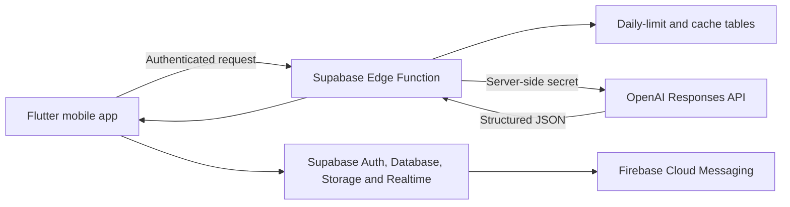

# Mohalla AI — Hyperlocal Community Alerts

Mohalla AI is a Flutter application that connects residents through useful posts from their nearby area. People can publish safety alerts, report local issues, request help, share events, and post community updates. Its optional AI Post Assistant turns informal text into a clear, categorized, and optionally translated neighbourhood post.

> OpenAI Build Week 2026 submission for **Apps for Your Life**.

## The problem

Important neighbourhood information is usually scattered across messaging groups and social media. Phone numbers may be exposed, useful reports get buried, and people outside the affected area receive irrelevant messages. Mohalla focuses on information that is useful to people nearby.

## What it does

- Phone OTP authentication with Supabase Auth
- GPS-aware local community feed
- Country-level feed for wider announcements
- Anonymous identities in the local feed
- Safety, information, issue, and agriculture categories
- Photo attachments, replies, voting, emergency alerts, and push notifications
- Optional **Improve with AI** action during post creation
- Clear title and rewritten post text from GPT-5.6 Luna
- Automatic selection of `safety`, `info`, or `issue`
- Optional English or Hindi translation
- Three new AI generations per user per UTC day
- Cached results that do not consume another request

## AI Post Assistant

A resident might type:

```text
water not coming from morning near main road please check
```

Mohalla AI can return:

```text
Title: Water supply interruption near Main Road
Category: Issue
Description: Water has not been available near Main Road since this morning.
```

The user previews the suggestion and decides whether to apply it. The original post is never published automatically.

## Architecture



The mobile application never contains the OpenAI API key. The Edge Function authenticates the Supabase user, checks the cache and daily allowance, calls `gpt-5.6-luna` through the Responses API, validates structured output, and returns the result.

GPT-5.6 Luna was selected because OpenAI documents it as the cost-sensitive GPT-5.6 option. The integration uses structured outputs so category and text fields have a predictable schema.

## Technology

- Flutter and Dart
- Riverpod and GoRouter
- Supabase Auth, PostgreSQL, RLS, Storage, Realtime, and Edge Functions
- OpenAI Responses API with `gpt-5.6-luna`
- Firebase Cloud Messaging
- Geolocator and reverse geocoding

## Build Week scope

### Existing before Build Week

- Phone authentication and onboarding
- Supabase database and security policies
- GPS-based local feed and country feed
- Creating posts with images
- Replies, votes, alerts, profile, and push-notification foundations

The preserved baseline is Git commit `5ae1c9b` (`pre-build-week baseline`).

### Added during Build Week

- AI Post Assistant interface and preview flow
- GPT-5.6 Luna server-side integration
- Structured title, improved text, category, and translation output
- Per-user daily usage limits
- SHA-256-based result caching
- Failure-safe allowance rollback
- Hardened vote-count database function
- Authenticated storage upload policies
- Automated tests and Build Week documentation

See [BUILD_WEEK.md](BUILD_WEEK.md) for the detailed evidence map.

## Run locally

### Requirements

- Flutter SDK compatible with Dart `^3.6.0`
- Android Studio or an Android device/emulator
- A Supabase project
- A Firebase Android application for push notifications
- An OpenAI API key stored only as a Supabase secret

### 1. Install dependencies

```bash
flutter pub get
```

### 2. Configure Supabase

For a new database, run these files in the Supabase SQL Editor in order:

1. `supabase/schema.sql`
2. `supabase/migration_build_week_ai.sql`

For an existing Mohalla database, first apply any required GPS migration and then run `supabase/migration_build_week_ai.sql` once.

Set your project URL and public anon key in:

```text
lib/core/constants/app_constants.dart
```

The anon key is designed for client use; database protection depends on the included RLS policies. Never put a service-role key in Flutter.

### 3. Configure and deploy Mohalla AI

Log in to the Supabase CLI, link the project, and set the secret:

```bash
supabase login
supabase link --project-ref YOUR_PROJECT_REF
supabase secrets set OPENAI_API_KEY=YOUR_OPENAI_API_KEY
supabase functions deploy ai-post-assistant
```

Do not commit the OpenAI key or pass it with `--dart-define`.

### 4. Configure Firebase

Place the Firebase Android configuration at:

```text
android/app/google-services.json
```

Its Android package must be `com.codrikaz.mohalla`.

### 5. Run and test

```bash
flutter analyze
flutter test
flutter run
```

Build an Android APK with:

```bash
flutter build apk --release
```

Before distributing a release, replace the current debug signing configuration with a private release keystore.

## Testing the AI flow

1. Sign in with a test phone number.
2. Open **Naya post**.
3. Enter at least ten characters.
4. Select no translation, English, or Hindi.
5. Press **Improve**.
6. Review the generated title, category, post, and translation.
7. Press **Apply**, then publish the post.
8. Repeat the same input to demonstrate that a cached response does not consume the daily limit.

## Privacy and safety

- The OpenAI key remains in Supabase Edge Function secrets.
- AI use is manual and visible to the user.
- The prompt instructs the model not to invent people, locations, dates, incidents, or accusations.
- Inputs are restricted to the existing 500-character post limit.
- AI output must match a strict JSON schema.
- Cache and usage records are readable only by their owner.
- Phone numbers are hashed before profile storage.

Known limitation: the current local-feed implementation filters stored coordinates in the client after authenticated database retrieval. Before a public production launch, this should be replaced by a server-side geospatial query that never returns unrelated coordinates. It is documented here rather than hidden from reviewers.

## Devpost deliverables

- Repository: [github.com/codrikaz/Mohalla-AI](https://github.com/codrikaz/Mohalla-AI)
- Submission copy, video outline, and checklist: [DEVPOST_SUBMISSION.md](DEVPOST_SUBMISSION.md)
- Android APK: **add the final public download link before submission**
- Public demo video under three minutes: **add the final YouTube link before submission**
- Test credentials: **add controlled judging credentials privately in Devpost**
- Codex `/feedback` session ID: **generate after the implementation task is complete and add it to Devpost**

## Known limitations

- English and Hindi are the first translation targets.
- AI needs network connectivity and configured Supabase/OpenAI services.
- FCM requires a valid Firebase project.
- Phone OTP delivery requires a configured Supabase phone provider.
- Production release signing is not included in source control.

## License

This project is available under the [MIT License](LICENSE).
